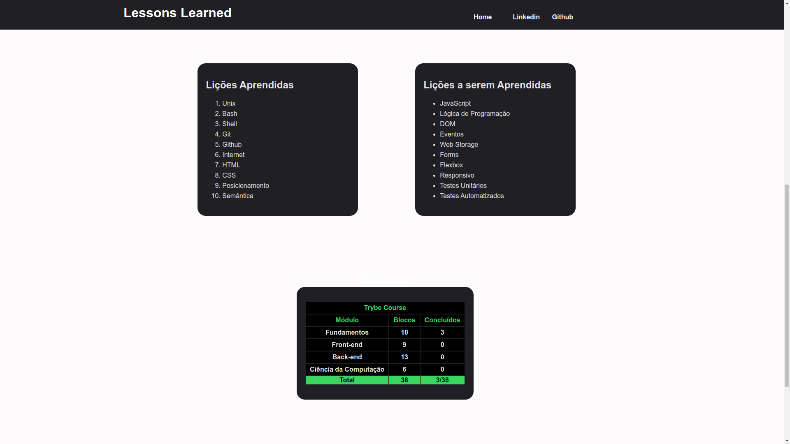

# Lessons Learned

# Contexto
Este projeto foi feito com o intuito de colocar em prática o conhecimento adquirido sobre HTML semântico, uso de classes e ids no CSS e posicionamneto de elementos.
Foi desenvolvido um site que contém informações sobre o que foi aprendido na Trybe nos três primeiros blocos. O site está com elementos posicionados e estilizados e além disto, contém semântica apropriada para que seja acessível e melhor ranqueado.

## Projeto Finalizado



## Habilidades Desenvolvidas
  * Utilizar HTML para construir páginas WEB.

  * Utilizar HTML semântico para tornar sua página mais acessível e melhor ranqueada.

  * Utilizar CSS para adicionar estilo e posicionar elementos.

---

## Ferramentas utilizadas

> Linguagens: `HTML/CSS`

> Verificador de Semântica: `CodeSniffer`


## Para clonar esse repositório:
1 - **Clonar projeto locamente**
```bash
git clone git@github.com:imgeff/lessons-learned.git
```

## Instalando Dependências

2 - **Entrar na  pasta do projeto**
```bash
cd lessons-learned
```
3 - **Instalar Dependências**
```bash
npm install
```
## Executando aplicação

* Para rodar a aplicação:

 - Baixe a extênsão `liveServer`
 - Clique com o botão direito no arquivo `index.html`e escolha a opção `Open with Live Server`